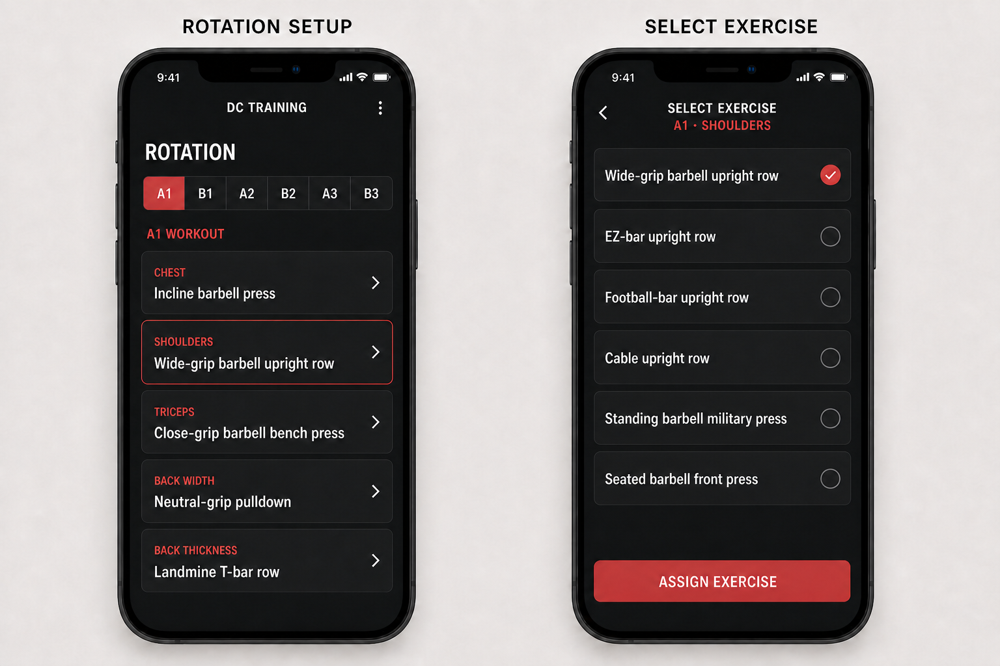

# Design

Owner-approved product design specifications belong here.

## Locked visual reference: rotation exercise selection

- Status: owner approved as pixel-for-pixel visual target.
- Exercise assignment occurs in Rotation Setup, not during a workout.
- Each A1/B1/A2/B2/A3/B3 body-part slot receives one exercise from the matching library category.
- Every exercise appears in one continuous list with identical styling and selection behavior.
- Source-document `†` notation is not displayed, grouped, dimmed, or treated as an app status.
- Replacing a slot assignment later must preserve prior workout and exercise history.

The mockup locks visual layout and display treatment. Exercise-assignment commit behavior remains a separate owner decision.
