# Design

Owner-approved product design specifications belong here.

## Locked visual reference: home

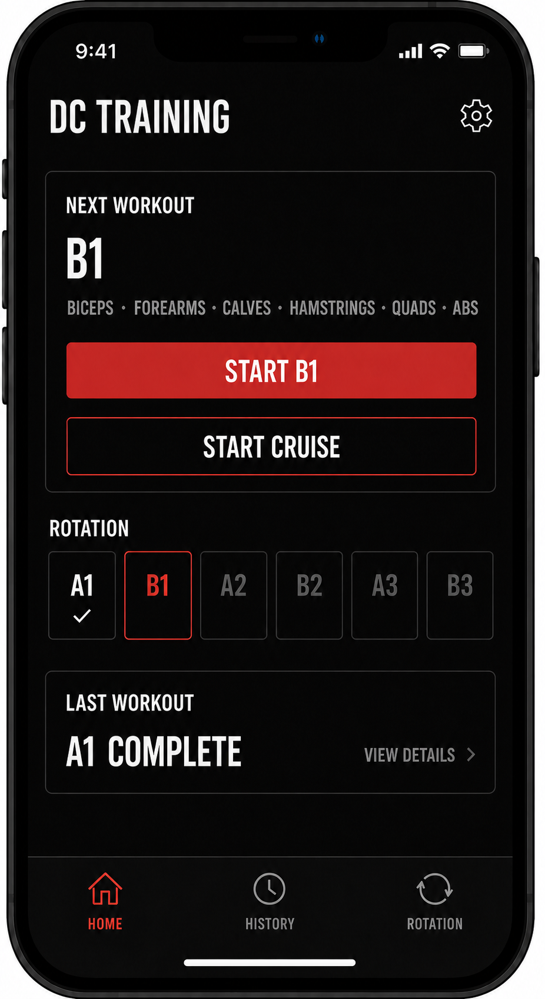

- Status: owner approved as pixel-for-pixel visual target for the no-active-workout state.
- Home is the app's default launch destination outside an active workout.
- The primary card shows the automatically determined next workout, its body-part summary, its position in the six-workout cycle, and one `START` action.
- The same primary card provides `START CRUISE` as a visible secondary outlined action; cruise is a main training action, not a Settings option.
- The rotation tracker is informational: the completed position is checked, the next position is highlighted, and future positions are subdued; it is not a manual workout selector.
- `LAST WORKOUT` shows the most recently completed rotation workout, and `VIEW DETAILS` opens that saved workout in History.
- The persistent bottom navigation contains `HOME`, `HISTORY`, and `ROTATION`; `ROTATION` opens Rotation Setup.
- Settings opens from the gear control in the top-right header.
- After the workout-complete screen, `DONE` returns to Home with the newly advanced next workout displayed.
- Workout names and values shown in the mockup are illustrative state examples and update dynamically.

## Locked visual reference: blast and cruise

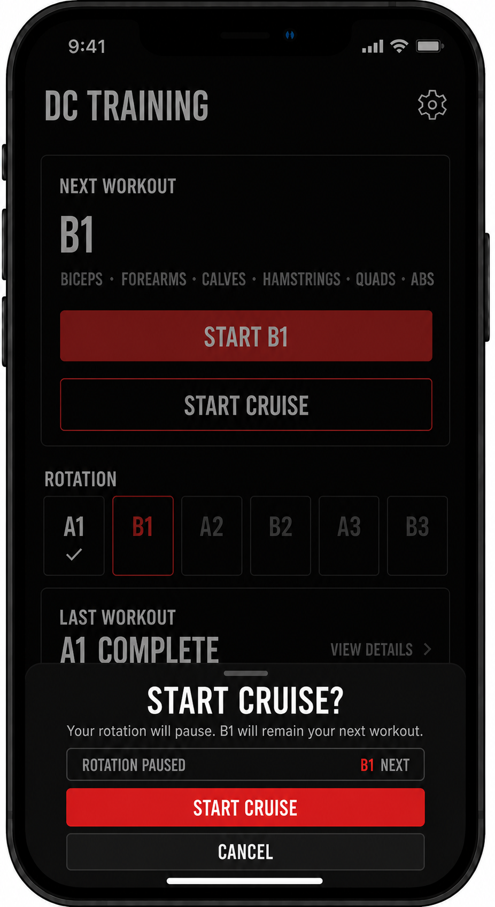

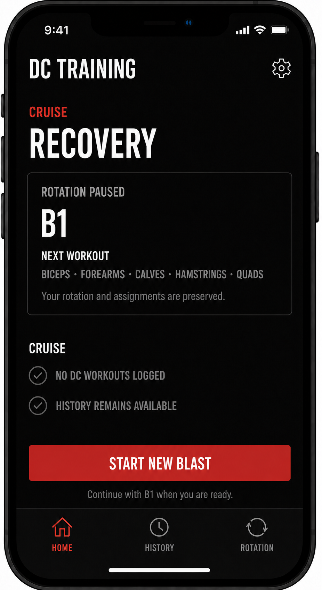

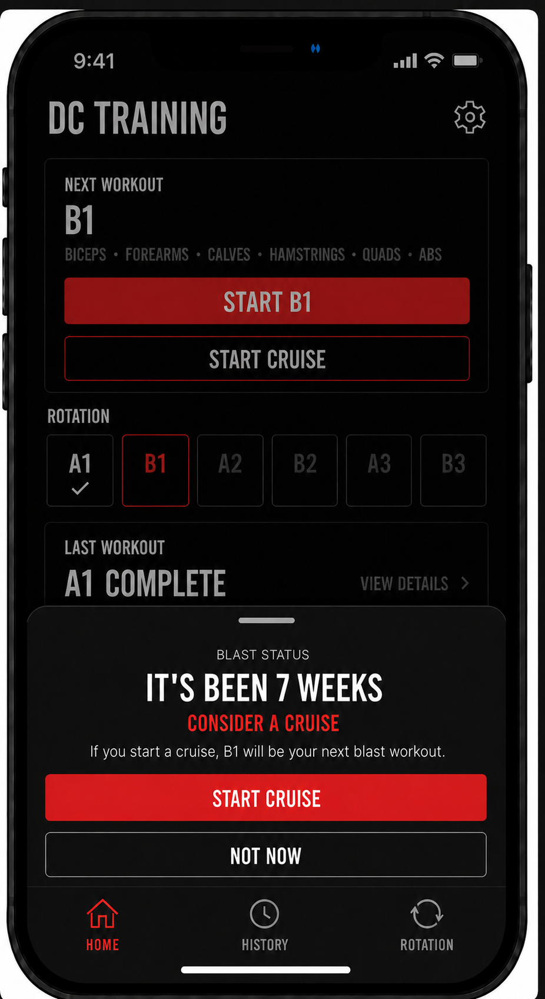

- Status: owner approved as pixel-for-pixel visual targets.
- The user alone initiates a cruise from the main Home screen by tapping `START CRUISE`; the app never schedules or automatically starts one.
- `START CRUISE` opens a confirmation sheet that states the rotation will pause and identifies the preserved next workout.
- Confirming starts cruise immediately; `CANCEL` returns to Home without changing training state.
- Cruise sits outside the `A1 → B1 → A2 → B2 → A3 → B3` rotation. It neither consumes nor resets a rotation position.
- During cruise, the Home screen shows `RECOVERY`, the paused rotation position, and the preserved next workout.
- No DC workouts are logged during cruise; history remains available.
- Cruise has no required reason, preset duration, calendar schedule, countdown, or automatic ending.
- `START NEW BLAST` is the single primary action on Cruise Home. It ends cruise and continues with the preserved next workout.
- Exercise assignments and historical performances remain preserved across cruise.
- The blast-age clock starts at day zero when the user taps `START NEW BLAST`, ends when cruise starts, and does not run during cruise.
- After seven elapsed blast weeks, the app shows one neutral suggestion after a completed workout and return to Home: `IT'S BEEN 7 WEEKS` / `CONSIDER A CRUISE`.
- The suggestion's sentence uses the dynamically preserved next rotation slot: `If you start a cruise, [slot] will be your next blast workout.` `B1` in the mockup is illustrative, never hardcoded.
- `START CRUISE` opens the approved confirmation flow; `NOT NOW` dismisses the suggestion without changing state, penalty, or repeated nagging during that blast.
- On the first appearance of each assigned exercise in a new blast, the saved performance establishes a fresh baseline and receives no win or failure verdict.
- Prior-blast performances remain visible for weight guidance, but cannot trigger failure in that first new-blast appearance; later appearances compare against the new-blast baseline and subsequent performances.
- Cruise controls do not appear in Settings.

## Locked visual reference: history

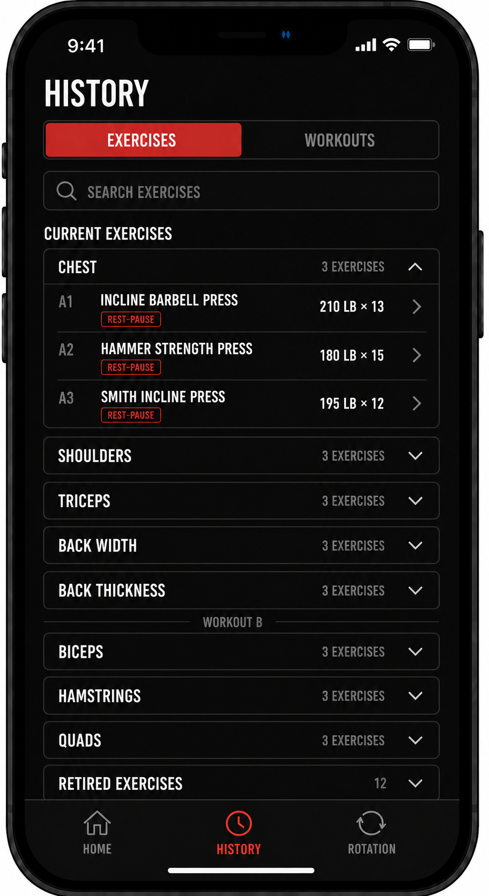

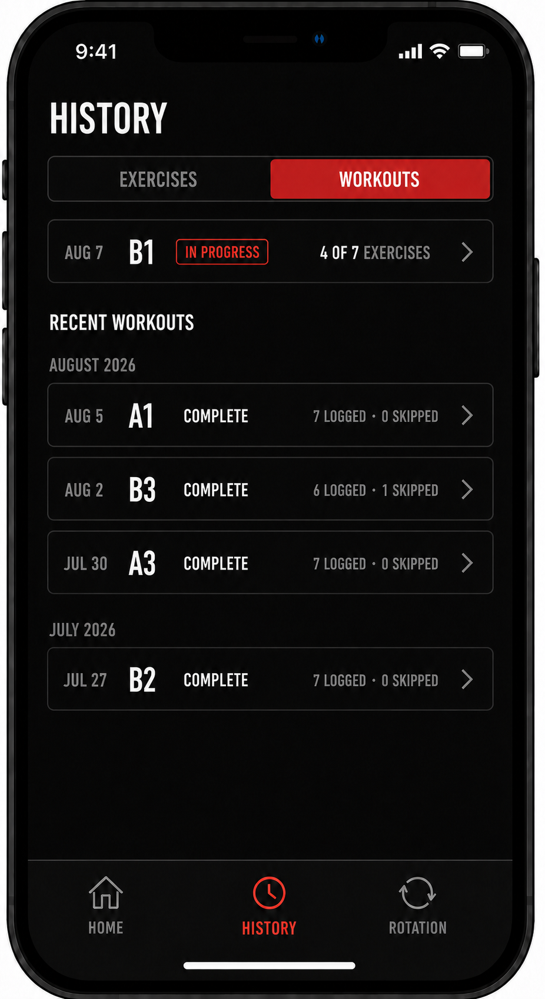

- Status: owner approved as pixel-for-pixel visual targets.
- History uses two views: `EXERCISES` and `WORKOUTS`; the selected view is highlighted in red.
- `WORKOUTS` shows any in-progress workout first, then completed workouts newest-first and grouped by month.
- Tapping a workout opens its saved entries for review and permitted correction.
- `EXERCISES` groups current exercises by body part instead of presenting one long flat list.
- Body-part groups follow workout order; each group contains its three variations in rotation-slot order (`A1`, `A2`, `A3` or `B1`, `B2`, `B3`), not alphabetical order.
- Only one body-part group is expanded at a time; opening another closes the current group.
- Search can open a matching exercise directly without requiring body-part navigation.
- `RETIRED EXERCISES` remains a separate collapsed group.
- Tapping an exercise opens its protocol-specific Exercise Performance screen.
- Exercise names, dates, weights, reps, and counts shown in the mockups are illustrative state examples and update dynamically.

## Locked visual reference: workout complete

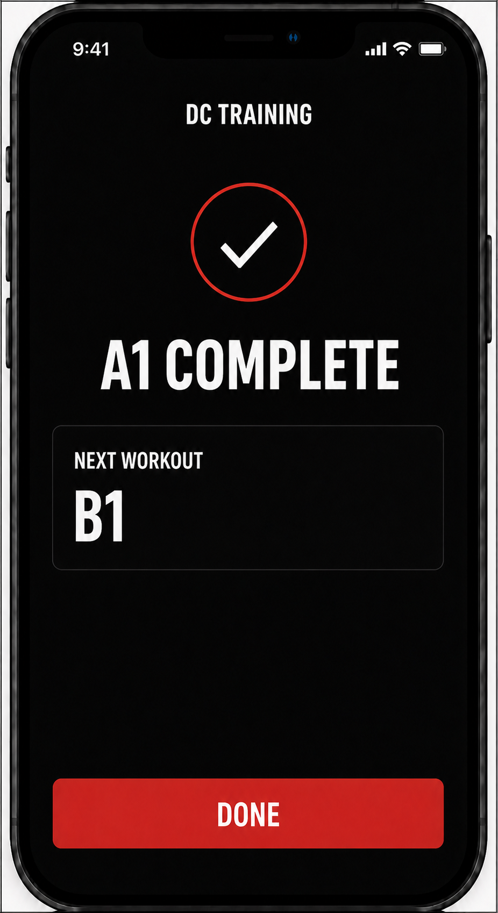

- Status: owner approved as pixel-for-pixel visual target.
- The screen appears after the final required workout step is completed or explicitly skipped and the workout has been saved as complete.
- It confirms the completed rotation workout and displays the automatically advanced next workout.
- The single action is `DONE`; the workout is already saved and the rotation already advanced before this button is tapped.
- `DONE` returns to Home, where the newly advanced next workout is displayed and ready to start.
- Workout names shown in the mockup are illustrative state examples and update dynamically.

## Locked visual reference: rotation exercise selection

- Status: owner approved as pixel-for-pixel visual target.
- Exercise assignment occurs in Rotation Setup, not during a workout.
- Each A1/B1/A2/B2/A3/B3 body-part slot receives one exercise from the matching library category.
- Every exercise appears in one continuous list with identical styling and selection behavior.
- Source-document `†` notation is not displayed, grouped, dimmed, or treated as an app status.
- Replacing a slot assignment later must preserve prior workout and exercise history.

## Locked visual reference: assignment review and save

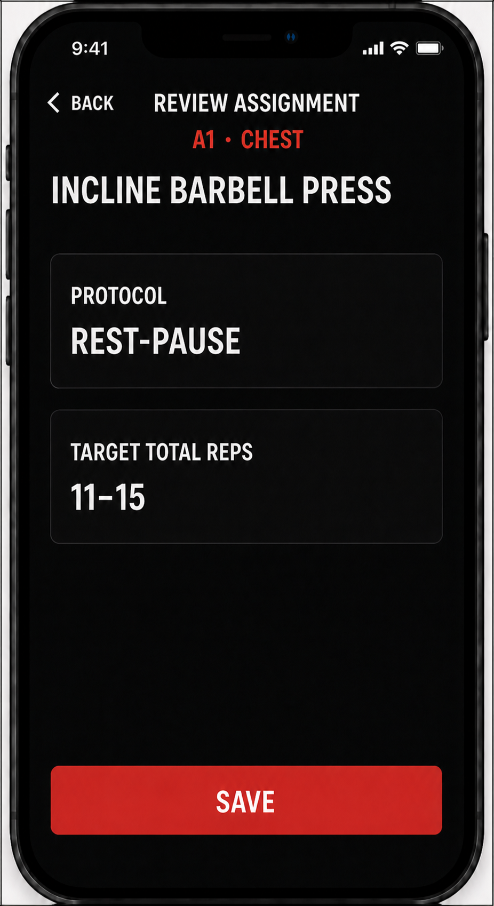

- Status: owner approved as pixel-for-pixel visual target.
- After exercise, protocol, and target-range selection, the app shows `REVIEW ASSIGNMENT` before committing the assignment.
- The top-left `BACK` control returns to the preceding assignment step and preserves all selections for editing.
- The single primary action is `SAVE`; there is no separate Cancel control or confirmation popup.
- `SAVE` commits the complete assignment once and returns to Rotation Setup.
- Exercise name, rotation slot, protocol, and target range shown in the mockup are illustrative placeholders, not locked assignment values.

## Locked automatic next-workout handling

- With no completed workout history, `A1` is next.
- The rotation order is fixed: `A1 → B1 → A2 → B2 → A3 → B3 → A1`.
- When the current workout becomes complete, whether logged live or finished later, the app advances to the next workout exactly once.
- Editing an already completed workout recalculates affected results but never advances the rotation again.
- Exercise replacement, historical correction, and abs configuration never change the rotation order.
- The next workout is determined automatically; there is no manual next-workout selector.

## Locked visual reference: straight-set entry

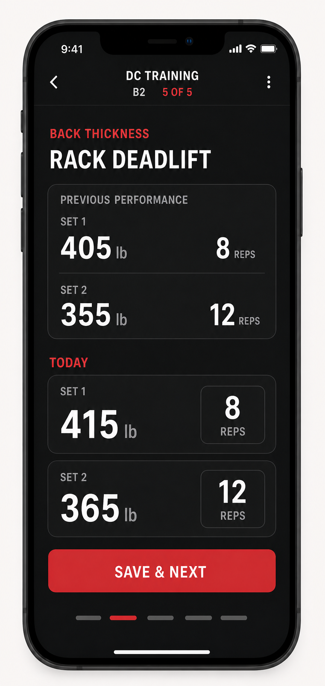

- Status: owner approved as pixel-for-pixel visual target.
- Rest-pause work sets use three manually entered mini-set rep boxes.
- Straight sets use one manually entered rep box per set.
- When an exercise has multiple straight sets, all sets appear together on one exercise screen.
- Previous Performance mirrors the current set structure and shows read-only weight and reps for every prior set.
- Today shows independently editable weight and one editable rep box for every straight set.
- Tapping a Today weight opens the iPhone numeric keypad for direct entry on the same screen; no separate edit screen or stepper controls.
- `SAVE & NEXT` saves all displayed Today-set weights and reps together.
- `SAVE & NEXT` retains the previously approved instant-save-plus-undo behavior.
- Undo is available immediately after the current save for fast correction.
- Historical performance entries remain editable so genuine weight, rep, or duration mistakes can be corrected later.
- Saving a correction to an already completed workout recalculates affected logbook comparisons but does not advance the rotation again.
- A workout may be entered or finished later. When the missing data changes the current workout from incomplete to complete, the rotation advances normally regardless of when the data is entered.
- Historical corrections and late entry never change exercise assignments.
- Weights, reps, exercise choice, and number of sets shown in the mockup are illustrative placeholders, not locked protocol rules.

This decision locks display behavior only. Exercise-specific protocol assignments remain separate owner decisions.

## Locked skip behavior

- Every exercise and extreme-stretch step provides a secondary `SKIP` action.
- Skipping never requires a reason.
- The skipped item is recorded as `Skipped` and an immediate `UNDO` action is available for accidental taps.
- A skipped exercise does not create a logbook result and never counts as a failure or triggers mulligan or replacement enforcement.
- Skipping does not change the exercise assignment; the exercise remains assigned for its next rotation appearance.
- An explicitly skipped item satisfies that step for the current workout, so the workout can still be completed and the rotation can advance normally.

## Locked incomplete and abandoned workout handling

- Leaving a workout before completion preserves every saved entry and keeps that workout `IN PROGRESS`.
- The rotation does not advance while the workout remains incomplete.
- Reopening the workout resumes at its first unfinished exercise or stretch step.
- The owner can finish missing entries later or explicitly skip unfinished items; there is no time limit or automatic discard.
- When every required step is completed or explicitly skipped, the workout becomes complete and the rotation advances exactly once.

## Locked visual reference: settings

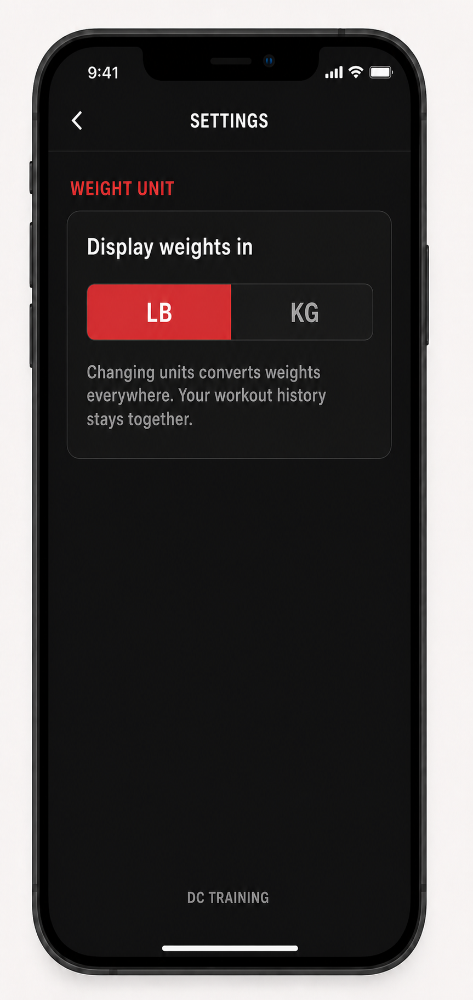

- Status: owner approved as pixel-for-pixel visual target.
- Settings includes weight unit selection: lb or kg.
- LB and KG appear as a two-choice segmented control, with the selected unit highlighted in muted red.
- Tapping LB or KG applies the change immediately; there is no Save button.
- Switching lb and kg converts all displayed workout and performance-history weights; it never creates separate histories.
- No haptic-feedback setting; custom haptics are not reliably available to the planned iPhone web app/PWA.
- No workout or rest timer.
- No timer sound setting.
- No keep-screen-awake setting.
- No gender, height, bodyweight, or other unused profile fields.

## Locked logbook-failure enforcement

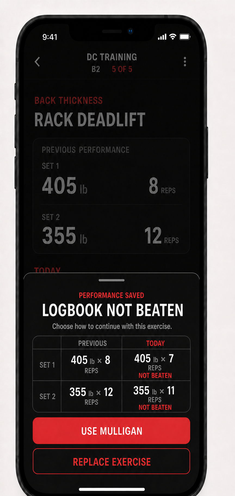

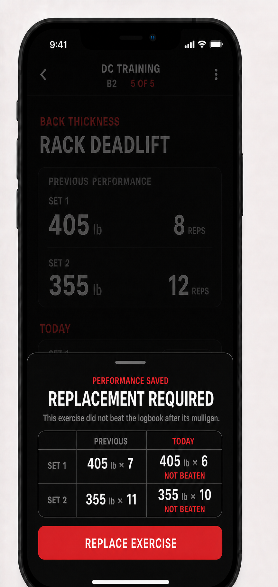

- After saving a performance, the app evaluates it against the previous performance for that same exercise.
- Beating the logbook saves the performance, clears any prior failure or mulligan state, and continues the workout.
- On the first consecutive failure, the saved performance triggers a blocking choice: `USE MULLIGAN` or `REPLACE EXERCISE`.
- `USE MULLIGAN` keeps the exercise for exactly one more appearance and marks it as mulligan-used.
- `REPLACE EXERCISE` immediately opens the matching body-part exercise library; the replacement applies to future appearances.
- At the next appearance after a mulligan, a win clears the mulligan state. A second consecutive failure requires replacement and offers no second mulligan.
- A failed performance remains in workout history. Replacing an exercise never deletes or rewrites its history, and the retired exercise remains available for later reuse.
- The next appearance after using a mulligan visibly shows `MULLIGAN USED`.
- There is no dismiss, ignore, or keep-the-exercise option when replacement is required.
- The first-failure prompt is blocking and offers only `USE MULLIGAN` or `REPLACE EXERCISE`.
- The post-mulligan failure prompt is blocking and offers only `REPLACE EXERCISE`.
- For multiple-straight-set exercises, both prompts show every matching set comparison separately; a failure prompt appears only when no set wins.
- Exercise names, weights, reps, and set counts shown in these prompt mockups are illustrative state examples and update dynamically.

## Locked returning-retired-exercise behavior

- Reassigning a retired exercise preserves and displays all of its prior performances as reference for choosing a sensible starting weight.
- The first performance after reassignment establishes a fresh baseline and receives no win or failure verdict.
- That fresh-baseline performance cannot trigger mulligan or replacement enforcement.
- Later performances compare against the new assignment's baseline and subsequent performances, not against the retired assignment's final record.
- Prior and current performances remain part of the same exercise history, with the reassignment boundary visibly distinguished.

## Locked visual reference: rest-pause exercise performance

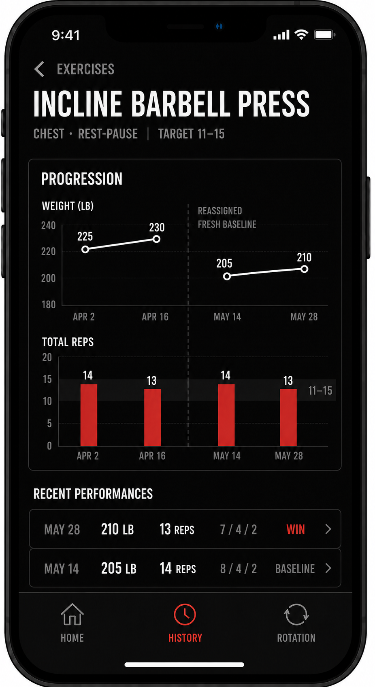

- Status: owner approved as pixel-for-pixel visual target.
- Exercise Performance charts one exercise at a time; performances from different exercises are never combined into one progression score.
- Rest-pause progression uses two aligned chart bands on the same date positions: weight as a line and total reps as bars.
- The selected target total-rep range appears as a subdued reference band; exact mini-set reps remain visible in the performance rows.
- Reassignment is marked by a visible `REASSIGNED / FRESH BASELINE` boundary, and the weight line never connects the retired assignment to the new assignment.
- Recent performance rows show date, weight, total reps, mini-set distribution, and verdict; opening a row provides review and correction of the saved entry.
- Exercise names, dates, weights, reps, and verdicts shown in the mockup are illustrative state examples and update dynamically.

## Locked visual reference: multiple-straight-set exercise performance

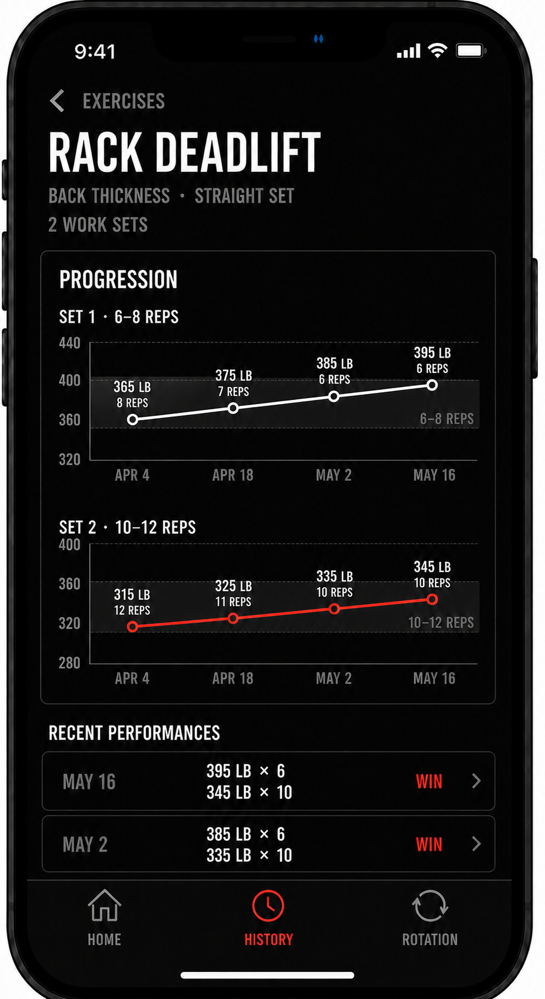

- Status: owner approved as pixel-for-pixel visual target.
- Each prescribed straight-set position receives its own progression lane; different set positions are never summed or merged into one line or score.
- Set lanes use neutral ordinal labels such as `SET 1` and `SET 2`, followed by that assignment's target range; the app does not impose labels such as `HEAVY SET` or `BACK-OFF SET`.
- Every chart point preserves both weight and reps, while target ranges appear as subdued reference bands.
- Recent performance rows keep all set results together for that date and open the saved performance for review and correction.
- Exercise names, dates, set counts, ranges, weights, reps, and verdicts shown in the mockup are illustrative state examples and update dynamically.

## Locked timed-hold exercise-performance variation

- Timed-hold exercise history reuses the approved Exercise Performance layout; it does not require a separate screen design.
- Its aligned progression bands show weight as a line and hold duration in seconds as bars.
- No target-range reference band is shown because timed-hold abs assignments have no target duration range.
- Recent performance rows show date, weight, duration, and verdict and open the saved performance for review and correction.
- Reassignment uses the same visible fresh-baseline boundary and disconnected weight line as every other returned exercise.

Remaining protocol-specific comparison and range rules are unresolved except where locked below.

## Locked rest-pause range ownership

- Each rest-pause exercise assignment has an owner-selected target total-rep range.
- The range is selected during Rotation Setup after choosing the exercise.
- Available choices are `11–15`, `15–20`, and `CUSTOM`; `11–20` is not a preset.
- `CUSTOM` accepts an owner-entered minimum and maximum, including exercise-specific higher ranges when desired.
- The range belongs to that exercise's rotation-slot assignment, not universally to its body part.
- The three workout rep boxes remain manual performance entry; their sum is the rest-pause total compared with the target range.
- The target range guides logbook evaluation but does not prefill, limit, or alter manually entered reps.
- First performance after assigning a new exercise establishes its baseline and produces no win/failure result.

- No range is preselected. The owner must explicitly tap `11–15`, `15–20`, or `CUSTOM` before completing the exercise assignment.

## Locked rest-pause logbook comparison

- The first performance after assigning a new exercise establishes its baseline and receives no win or failure result.
- A later rest-pause performance beats the logbook only when either:
  - weight increases and total reps remain within the assignment's selected range; or
  - weight stays the same and total reps increase.
- Every other later result fails to beat the logbook, including a heavier performance below the selected minimum, a lower-weight performance, or unchanged weight with unchanged or fewer total reps.
- Mini-set distribution does not affect the verdict; the comparison uses weight and the sum of all three manually entered mini-set reps.

## Locked warm-up handling

- The app records logbook work sets only.
- Warm-up and ramping sets are performed outside the app and have no entry fields, history, win/failure verdict, or progression enforcement.
- This keeps warm-ups distinct from the all-out performances used to beat the logbook.

## Locked extreme-stretch flow: chest, triceps, shoulders, biceps, back, hamstrings, and quads

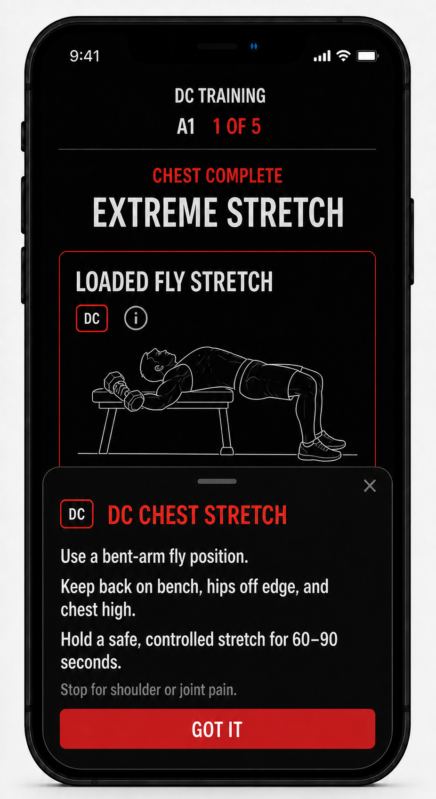

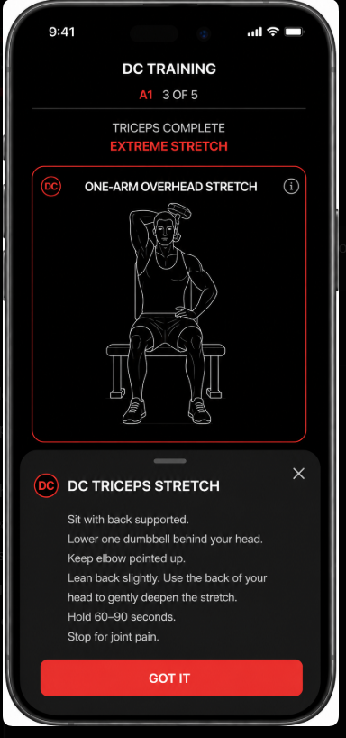

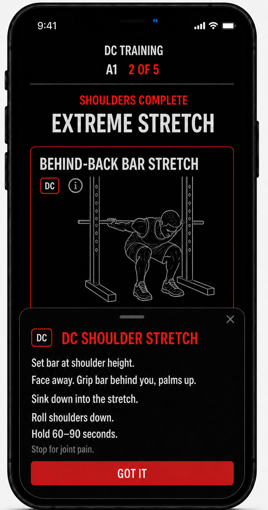

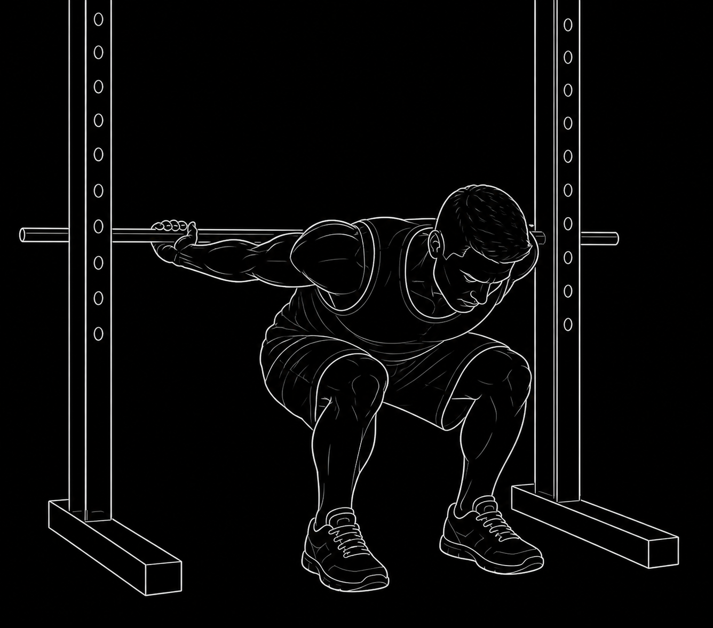

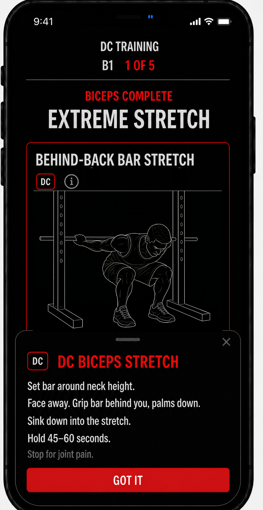

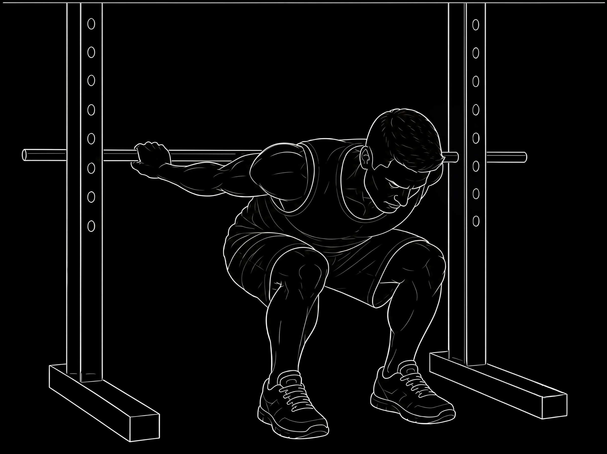

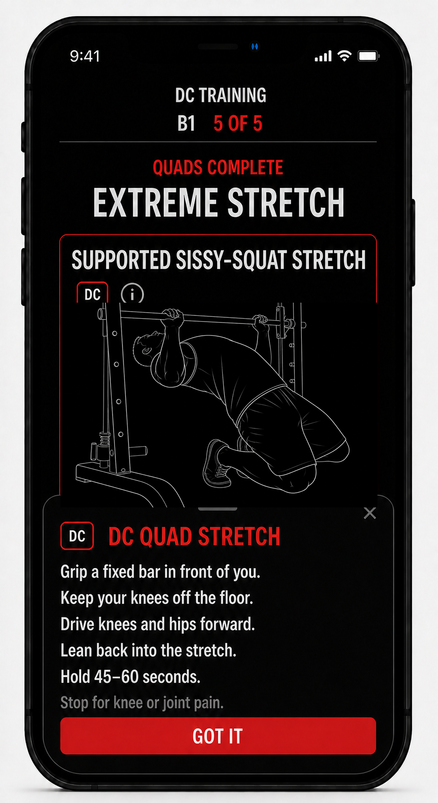

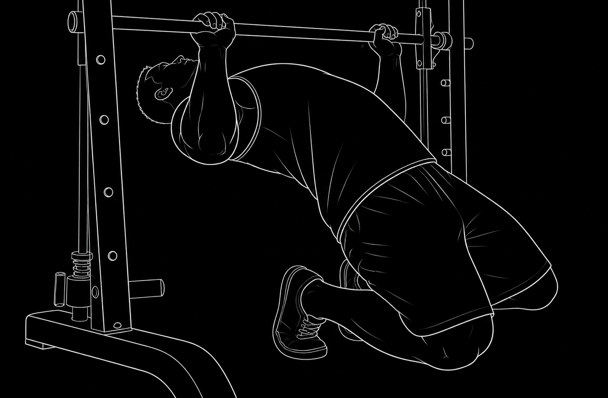

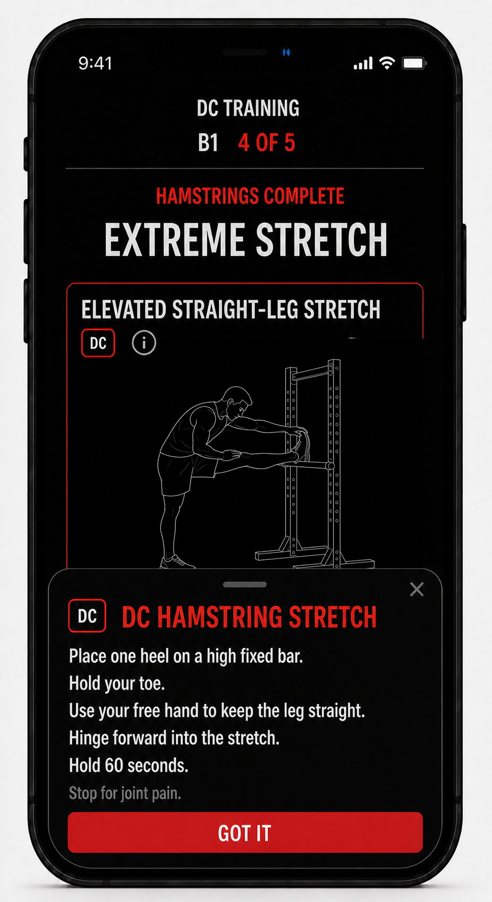

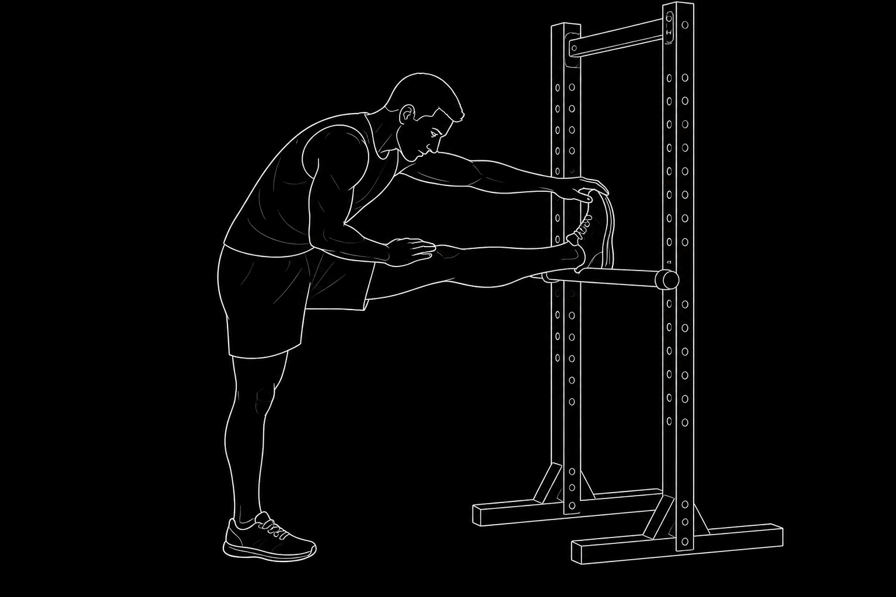

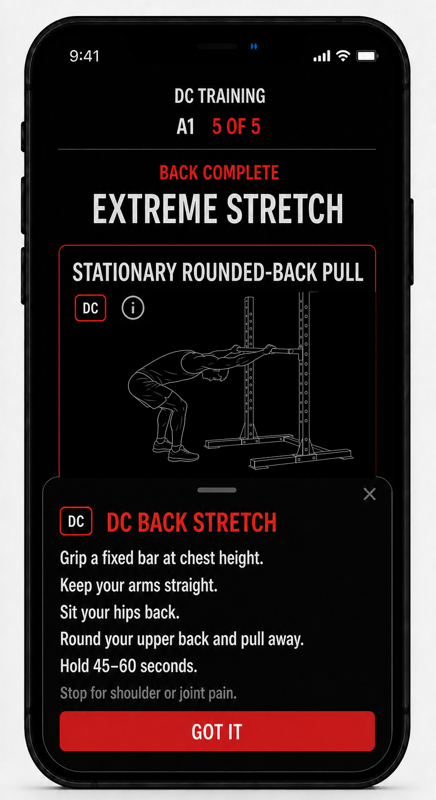

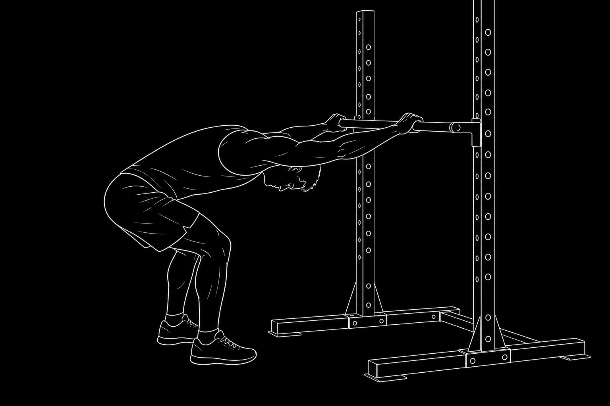

- Status: owner approved as pixel-for-pixel visual target.
- After each relevant body part's work set, the app presents its extreme-stretch step before advancing; the owner can complete or explicitly skip it.
- The step uses a source-grounded position illustration, a compact `DC` badge and information icon, and a red `STRETCH COMPLETE` action.
- The app provides no stretch timer, countdown, weight entry, or stretch-performance history.
- Calves receive no separate extreme-stretch step because the approved classic calf work-set protocol already embeds a loaded bottom-position stretch in every repetition.
- Chest uses the loaded bent-arm fly stretch shown in the approved visual. The illustration must keep the back supported on the bench, place the hips beyond the bench edge, keep both feet planted, raise the chest safely, and show bent elbows in the bottom fly position.
- Chest information-panel copy is exactly:
  - `Use a bent-arm fly position.`
  - `Keep back on bench, hips off edge, and chest high.`
  - `Hold a safe, controlled stretch for 60–90 seconds.`
  - `Stop for shoulder or joint pain.`
- Triceps uses the seated one-arm overhead dumbbell stretch shown in the approved visual: front-facing, feet planted, free hand on hip, working elbow overhead, and one dumbbell held behind the head.
- Triceps information-panel copy is exactly:
  - `Sit with back supported.`
  - `Lower one dumbbell behind your head.`
  - `Keep elbow pointed up.`
  - `Lean back slightly. Use the back of your head to gently deepen the stretch.`
  - `Hold 60–90 seconds.`
  - `Stop for joint pain.`
- Shoulder uses the owner-approved behind-back bar illustration without reinterpretation. The fixed bar stays behind the lifter; the torso moves forward and down onto the heels while the bar pulls both arms behind the body.
- Shoulder screen uses the same graphic-design template as the approved chest-stretch screen.
- Shoulder information-panel copy is exactly:
  - `Set bar at shoulder height.`
  - `Face away. Grip bar behind you, palms up.`
  - `Sink down into the stretch.`
  - `Roll shoulders down.`
  - `Hold 60–90 seconds.`
  - `Stop for joint pain.`
- Biceps uses the owner-supplied behind-back bar illustration without redraw or reinterpretation. The approved screen uses the same graphic-design template as the approved chest-stretch screen.
- Biceps information-panel copy is exactly:
  - `Set bar around neck height.`
  - `Face away. Grip bar behind you, palms down.`
  - `Sink down into the stretch.`
  - `Hold 45–60 seconds.`
  - `Stop for joint pain.`
- Quads use the owner-approved supported sissy-squat-style illustration without redraw or reinterpretation. The fixed bar stays in front of and above the lifter; the knees remain off the floor while the knees and hips drive forward and the torso leans back.
- The quad screen uses the same graphic-design template as the approved chest-stretch screen.
- Quad information-panel copy is exactly:
  - `Grip a fixed bar in front of you.`
  - `Keep your knees off the floor.`
  - `Drive knees and hips forward.`
  - `Lean back into the stretch.`
  - `Hold 45–60 seconds.`
  - `Stop for knee or joint pain.`
- Hamstrings use the owner-approved elevated straight-leg illustration without redraw or reinterpretation. One heel rests on a high fixed bar; one hand holds the toe; the free hand keeps the elevated leg straight while the lifter hinges forward.
- The hamstring screen uses the same graphic-design template as the approved chest-stretch screen.
- Hamstring information-panel copy is exactly:
  - `Place one heel on a high fixed bar.`
  - `Hold your toe.`
  - `Use your free hand to keep the leg straight.`
  - `Hinge forward into the stretch.`
  - `Hold 60 seconds.`
  - `Stop for joint pain.`
- Back uses the owner-selected stationary rounded-back pull shown in the approved illustration. The lifter grips a fixed bar, keeps both arms straight, sits the hips back, rounds the upper back, and pulls away from the stationary support.
- The back screen uses the same graphic-design template as the approved chest-stretch screen.
- Back information-panel copy is exactly:
  - `Grip a fixed bar at chest height.`
  - `Keep your arms straight.`
  - `Sit your hips back.`
  - `Round your upper back and pull away.`
  - `Hold 45–60 seconds.`
  - `Stop for shoulder or joint pain.`

## Locked multiple-straight-set verdict

- This is an owner-selected app rule for a gap not resolved by the reviewed direct Dante material.
- Each individual straight set wins only when weight increases while reps remain within that set's assigned range, or when weight stays the same and reps increase.
- Every other later result makes that individual set a loss, including a heavier set below its selected minimum, a lower-weight set, or unchanged weight with unchanged or fewer reps.
- Each set is compared with its matching prior set and shown as an individual win, tie, or loss.
- When at least one set wins, the exercise automatically beats the logbook and clears any failure or mulligan state.
- When no set wins, the exercise automatically fails to beat the logbook; ties do not count as wins.
- There is no mixed-result verdict or owner choice.
- All entered set performances remain saved regardless of the overall verdict.

## Locked visual reference: protocol selection

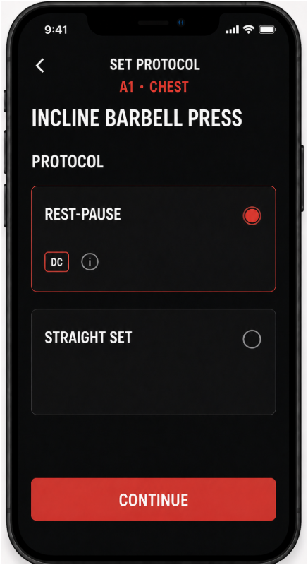

- Status: owner approved as pixel-for-pixel selected-state visual target.
- The app never auto-assigns an exercise protocol.
- During Rotation Setup, the owner must explicitly select the protocol for every assigned exercise.
- Source-grounded DC guidance may be displayed beside protocol choices, but it must not preselect or silently enforce a choice.
- A compact outlined `DC` badge marks the source-grounded option; the badge is informational, not a selection state.
- Protocol cards contain only their protocol names; explanatory descriptions are omitted.
- The screenshot shows Rest-Pause after the owner tapped it: selected red control and red card border.
- `CONTINUE` is disabled before protocol selection and becomes red/actionable only after the owner selects an option.
- The adjacent information icon provides supporting context; exact information-panel copy remains unresolved.
- Treatment for exercises with multiple documented DC protocol variants remains unresolved.

## Locked chest protocol mapping

- Applies to every chest exercise in the owner-provided exercise pool.
- Rotation Setup shows `REST-PAUSE` and `STRAIGHT SET`; neither is preselected.
- `REST-PAUSE` carries the `DC` badge. `STRAIGHT SET` does not.
- After selecting Rest-Pause, the range choices are `11–15`, `15–20`, and `CUSTOM`; none is preselected.
- `11–15` carries the `DC` badge. `15–20` and `CUSTOM` do not.
- Chest protocol information-panel copy is exactly: `Classic DC uses one rest-pause work set.`
- The panel adds no redundant body-part, exercise, failure, or safety explanation.

## Locked shoulder protocol mapping

- Applies to every shoulder exercise in the owner-provided exercise pool.
- Rotation Setup shows `REST-PAUSE` and `STRAIGHT SET`; neither is preselected.
- `REST-PAUSE` carries the `DC` badge. `STRAIGHT SET` does not.
- After selecting Rest-Pause, the range choices are `11–15`, `15–20`, and `CUSTOM`; none is preselected.
- No shoulder range choice carries the `DC` badge because reviewed DC material does not establish a clean exercise-by-exercise split between `11–15` and `15–20`.
- Range remains an explicit owner choice; the app does not infer it from the selected shoulder exercise.

## Locked triceps protocol mapping

- Rotation Setup shows `REST-PAUSE` and `STRAIGHT SET`; neither is preselected.
- `REST-PAUSE` carries the `DC` badge. `STRAIGHT SET` does not.
- Press exercises offer `11–15`, `15–20`, and `CUSTOM`; none is preselected and no range carries the `DC` badge.
- Extension exercises offer `11–15`, `15–30`, and `CUSTOM`; none is preselected.
- For extension exercises, `15–30` carries the `DC` badge. `11–15` and `CUSTOM` do not.
- Extension exercises do not offer `15–20`; `15–30` replaces that overlapping choice.

## Locked back-width protocol mapping

- Applies to every back-width exercise in the owner-provided exercise pool.
- Rotation Setup shows `REST-PAUSE` and `STRAIGHT SET`; neither is preselected.
- `REST-PAUSE` carries the `DC` badge. `STRAIGHT SET` does not.
- After selecting Rest-Pause, the range choices are `11–15`, `15–20`, and `CUSTOM`; none is preselected.
- `11–15` carries the `DC` badge. `15–20` and `CUSTOM` do not.

## Locked back-thickness protocol mapping

- Rotation Setup shows `REST-PAUSE` and `STRAIGHT SET`; neither is preselected.
- `STRAIGHT SET` carries the `DC` badge. `REST-PAUSE` does not.
- Conventional deadlift, rack deadlift, and trap-bar deadlift offer a two-set `6–8` plus `10–12` structure carrying the `DC` badge, or `CUSTOM`; neither is preselected.
- Trap-bar deadlift intentionally inherits the same badge treatment because the owner considers it sufficiently equivalent to a straight-bar deadlift for this purpose.
- All row exercises offer one `10–12` straight set carrying the `DC` badge, or `CUSTOM`; neither is preselected.
- `CUSTOM` allows owner-selected set count and target range for each set and carries no badge.

## Locked biceps protocol mapping

- Applies to every biceps exercise in the owner-provided exercise pool.
- Rotation Setup shows `REST-PAUSE` and `STRAIGHT SET`; neither is preselected.
- `REST-PAUSE` carries the `DC` badge. `STRAIGHT SET` does not.
- After selecting Rest-Pause, the range choices are `11–15`, `15–20`, and `CUSTOM`; none is preselected.
- No biceps range carries the `DC` badge because reviewed DC material gives a broad `11–20` target rather than a reliable exercise-specific split between the two presets.

## Locked forearm protocol mapping

- Applies to every forearm exercise in the owner-provided exercise pool.
- Rotation Setup shows `REST-PAUSE` and `STRAIGHT SET`; neither is preselected.
- `STRAIGHT SET` carries the `DC` badge. `REST-PAUSE` does not.
- After selecting Straight Set, the structure choices are one set at `10–20`, carrying the `DC` badge, or `CUSTOM`; neither is preselected.
- `CUSTOM` carries no badge.

## Locked calf protocol mapping

- Applies to every calf exercise in the owner-provided exercise pool.
- Rotation Setup shows `REST-PAUSE` and `STRAIGHT SET`; neither is preselected.
- `STRAIGHT SET` carries the `DC` badge. `REST-PAUSE` does not.
- After selecting Straight Set, the structure choices are one set at `10–12`, carrying the `DC` badge, or `CUSTOM`; neither is preselected.
- `CUSTOM` carries no badge.
- The normal structure screen shows no lifting instructions and no timer. Approved visual: [calf structure](calf-structure-approved.png).
- Tapping the `10–12` information icon opens the approved bottom sheet: [calf information panel](calf-info-approved.png).
- Information-panel copy is exactly:
  - `Lower slowly over 5 seconds.`
  - `Hold the bottom position for 15 seconds.`
  - `Explode upward onto your toes.`
- The panel has no timer or countdown and closes through `×` or `GOT IT`.

## Locked hamstring leg-curl protocol mapping

- Applies to lying Deltech leg curl, single-leg lying leg curl, and standing cable leg curl.
- Rotation Setup shows `REST-PAUSE` and `STRAIGHT SET`; neither is preselected.
- `REST-PAUSE` carries the `DC` badge. `STRAIGHT SET` does not.
- After selecting Rest-Pause, the range choices are `15–30`, carrying the `DC` badge, or `CUSTOM`; neither is preselected.
- `15–20` is not offered because it would overlap `15–30`. `CUSTOM` carries no badge.

## Locked exercise-pool correction: wide-stance/sumo belt squat

- Wide-stance/sumo belt squat does not belong in the hamstring category.
- The app treats it as a quadriceps exercise only and does not inherit the DC sumo-leg-press protocol or badge.
- This owner-approved design correction overrides the duplicate hamstring placement in the current exercise-pool source without modifying that source file.

## Locked hamstring-hinge protocol selection

- Applies to all stiff-leg deadlift, Romanian deadlift, trap-bar hinge, and belt-squat hinge variations in the owner-provided exercise pool.
- Rotation Setup shows `REST-PAUSE` and `STRAIGHT SET`; neither is preselected and neither carries the `DC` badge.
- An information icon beside `PROTOCOL` uses exactly this copy: `DC handling varies for stiff-leg deadlifts and RDLs.`
- Both protocol choices remain available because direct DC material documents both and rejects one universal treatment.
- After selecting Straight Set, the structure choices are one set at `10–15`, carrying the `DC` badge, or `CUSTOM`; neither is preselected.
- `CUSTOM` allows owner-selected set count and target range for each set and carries no badge.
- Approved selected-state visual: [hamstring-hinge straight-set structure](hamstring-hinge-straight-structure-approved.png). Before selection, both choices are unselected and `CONTINUE` is disabled.

## Locked quadriceps barbell-squat protocol mapping

- Applies to barbell back squat and barbell front squat.
- Rotation Setup shows `REST-PAUSE` and `STRAIGHT SET`; neither is preselected.
- `STRAIGHT SET` carries the `DC` badge. `REST-PAUSE` does not.
- After selecting Straight Set, the structure choices are a heavy `4–6` set plus a `20`-rep widowmaker, carrying the `DC` badge, or `CUSTOM`; neither is preselected.
- The workout screen records the heavy set and widowmaker as two separate weight-and-rep entries. The widowmaker has one rep box, not rest-pause mini-set boxes.

## Locked quadriceps belt-squat protocol mapping

- Applies to belt squat plus narrow-, standard-, and wide-stance belt-squat variants.
- Belt squats inherit the barbell-squat classification completely; being a variant does not change the governing lift principle.
- Rotation Setup shows `REST-PAUSE` and `STRAIGHT SET`; neither is preselected.
- `STRAIGHT SET` carries the `DC` badge. `REST-PAUSE` does not.
- After selecting Straight Set, the structure choices are a heavy `4–6` set plus a `20`-rep widowmaker, carrying the `DC` badge, or `CUSTOM`; neither is preselected.
- No separate `6–10` preset is offered for belt squats.

## Locked quadriceps barbell-hack-squat protocol mapping

- Applies to barbell hack squat.
- Barbell hack squat inherits the DC hack-squat classification.
- Rotation Setup shows `REST-PAUSE` and `STRAIGHT SET`; neither is preselected.
- `STRAIGHT SET` carries the `DC` badge. `REST-PAUSE` does not.
- After selecting Straight Set, the structure choices are a heavy `6–10` set plus a `20`-rep widowmaker, carrying the `DC` badge, or `CUSTOM`; neither is preselected.

## Locked quadriceps leg-extension protocol mapping

- Leg extension remains fully available in the quadriceps exercise library.
- Rotation Setup shows `REST-PAUSE` and `STRAIGHT SET`; neither is preselected and neither carries the `DC` badge.
- After selecting either protocol, only `CUSTOM` structure is offered; nothing is preselected.
- No DC set or range badge is shown because reviewed direct Dante material favors progressively loaded hack squats and leg presses over leg extensions as primary quadriceps movements.

## Locked abs placement

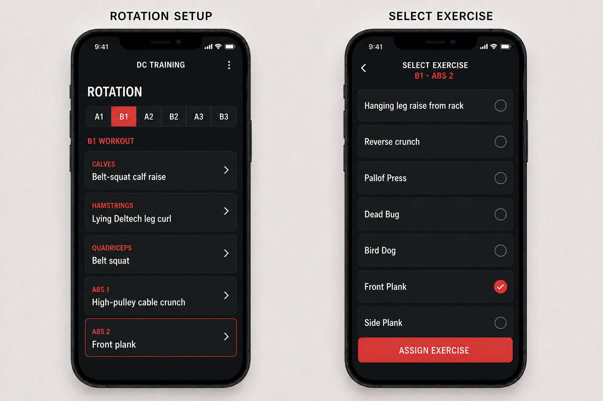

- Status: owner approved as pixel-for-pixel visual target.
- Abs are included on every leg-day workout: B1, B2, and B3.
- Abs remain structurally outside the classic five-body-part B rotation and do not create another rotation slot.
- Abs never change or advance the A1/B1/A2/B2/A3/B3 workout sequence.
- B1, B2, and B3 each have two separately configured, fixed ab exercise assignments; changing one does not change the others.
- The two slots are labeled `ABS 1` and `ABS 2`; neither label imposes an exercise type.
- Either slot can receive any exercise from the same full owner-provided abs exercise pool.

## Locked abs protocol types

- Every `ABS 1` and `ABS 2` assignment requires an explicit protocol choice; nothing is preselected.
- Available protocols are `STRAIGHT SET` and `TIMED HOLD` only.
- Each assigned abs exercise has exactly one work set.
- Abs assignments have no target rep or duration range.
- Workout entry shows the prior performance so the owner can determine how to beat the logbook.
- For both protocols, the app automatically records a win when weight is unchanged and reps or duration increase, or when weight increases without reps or duration decreasing.
- The app automatically records a failure for an unambiguous regression: weight is unchanged and reps or duration do not increase, or weight decreases without reps or duration increasing.
- When weight and reps or duration move in opposite directions, the result is ambiguous; the app shows both performances and requires the owner to choose `COUNT AS WIN` or `COUNT AS FAILURE`.
- Abs use the same locked failure enforcement as core rotation exercises: first consecutive failure requires `USE MULLIGAN` or `REPLACE EXERCISE`; a second consecutive failure after using the mulligan requires replacement.
- Replacing an abs assignment affects only that B workout and abs slot and preserves all prior performance history.
- `REST-PAUSE` is not offered for abs.
- Neither protocol carries a `DC` badge because reviewed direct Dante material does not establish one universal abs protocol.
- Timed-hold performance is entered manually as duration; the app provides no timer.

## 6. App foundation

### Authentication

- An account is required before the app can be used.
- Anonymous and guest use are not supported.
- Initial release supports one private owner account; future multi-user growth remains possible but is not built now.
- Initial authentication uses email and password only; social sign-in methods are not included.
- Supabase Free provides authentication for the initial release.
- Public account registration is not shown; the initial owner account is created during app setup.
- First use opens the sign-in screen. Returning use keeps the owner signed in and opens Home.
- An expired or revoked session returns the owner to the sign-in screen.
- Settings adds an outlined `SIGN OUT` action at the bottom of the approved screen.
- Sign-out requires no confirmation and returns to the sign-in screen.
- Sign-out does not complete while local changes are waiting to sync; those changes must first be saved safely.
- The sign-in screen provides `FORGOT PASSWORD?`, which sends a single-use, time-limited reset link to the owner email.
- A password reset preserves all workout data and signs out other authenticated sessions.
- Security questions and recovery codes are not included in the initial release.
- Supabase's built-in email service is acceptable only for the initial pre-authorized owner address. Reliable custom SMTP becomes required before adding other users or after any delivery failure.
- Workout data cannot be created before the first successful sign-in.
- Device-local workout data is always tied to the authenticated owner account.
- After session expiry, local workout data remains hidden until the same owner signs in again; queued syncing then resumes.
- Local data that cannot be verified as belonging to the signed-in account is never merged or uploaded.
- No anonymous-data import or merge flow is provided.

### Cloud persistence

- The cloud database is the authoritative copy of workout and configuration data.
- The iPhone keeps a local working copy for responsive and temporary-offline use; it is not the only permanent copy.
- Every personal record belongs to one authenticated account, and cloud-side access rules enforce that ownership.
- Future accounts are isolated automatically; one account can never read or change another account's data.
- All durable app state syncs: settings, rotation and exercise assignments, blast/cruise state, in-progress workouts, completed history, corrections, skips, mulligans, and replacement state.
- Temporary interface state, such as the currently open tab or expanded panel, does not sync.
- Each meaningful user action saves to the device immediately and begins cloud sync immediately when connected; the user never needs a manual Save-to-cloud action.
- One device per account is the active editing device; other signed-in devices may restore and view synced data but cannot change it.
- Transferring edit access to another device requires connectivity, completes any pending sync first, and makes the prior device read-only.
- Because only one device can edit, conflicting simultaneous changes are prevented instead of merged.
- A replacement device restores all successfully synced data after sign-in; no manual import is required.
- Changes that existed only on a lost device and never synced cannot be recovered.
- Supabase Free provides the authoritative Postgres database; Vercel Hobby hosts the personal, non-commercial PWA.
- Cloudflare is optional for DNS only in the initial release; Cloudflare D1 and R2 are not part of the app foundation.
- A daily GitHub Actions job creates an encrypted logical Supabase backup and retains it as a private workflow artifact for 30 days.
- Backup failures must be visible in GitHub Actions. Recovery is operator-led; no backup controls or version-history interface are included in the initial app.
- The initial foundation targets current free-plan limits. Paid services are reconsidered only when limits, reliable email delivery, or real multi-user growth require them.
- Privileged Supabase credentials remain server-side or in protected deployment and GitHub secrets; only the documented browser-safe project URL and publishable key may reach the client.
- `DELETE ACCOUNT` requires password re-entry and an explicit permanent-deletion warning.
- Account deletion signs the owner out and starts a 30-day recovery window during which the account and its data are unavailable.
- During that window, the owner can authenticate and explicitly cancel deletion. After 30 days, live cloud data and device-local data are permanently deleted; encrypted backup artifacts expire no later than 30 additional days afterward.

### Temporary offline behavior

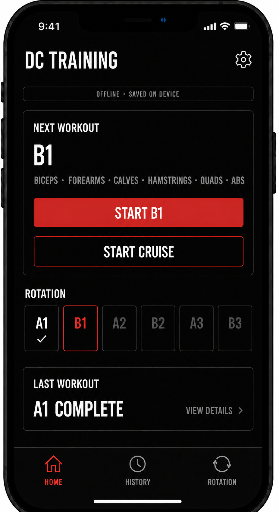

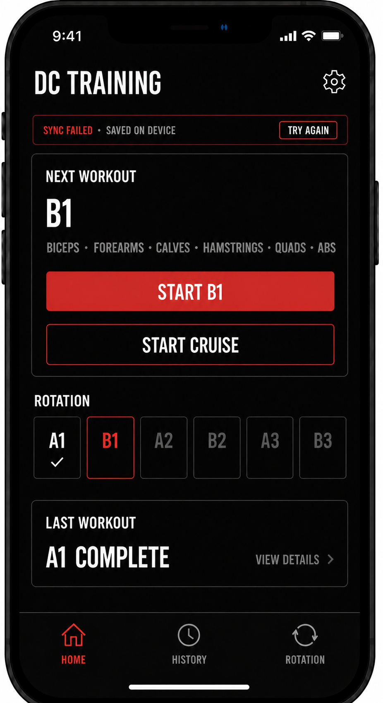

- After one successful online sign-in and initial load, the active editing iPhone can open the cached app and previously synced data without a connection.
- Routine training remains usable offline: viewing cached history, starting or resuming a workout, entering or correcting performances, skipping or undoing steps, completing a workout, changing assignments, and starting or ending cruise.
- First sign-in, password recovery, sign-out, account deletion or recovery, active-device transfer, initial restore on a replacement device, and access to data never cached on the device require connectivity.
- The service worker and Cache Storage hold the app shell and static assets. IndexedDB holds account-bound working data and a durable queue of pending changes.
- Each meaningful action writes its data and one uniquely identified pending operation to IndexedDB together. If that local write fails, the app blocks progress and never reports the action as saved.
- Sync runs immediately while connected and whenever the app returns to the foreground or observes a successful reconnection. The app does not depend on background execution after it is closed.
- Every queued operation carries a stable unique identifier, and the cloud database rejects a repeated identifier. Retrying can never create a duplicate save or advance rotation twice.
- The active editing device may continue through temporary sync failures because confirmed local writes remain queued. A non-active device remains read-only.
- Cloud writes from an old or non-active device are rejected rather than merged. Transferring edit access requires connectivity and warns the owner not to continue editing on the prior device.
- The interface always distinguishes `OFFLINE`, `SYNCING`, `SYNCED`, and `SYNC FAILED`. Offline and failure states state clearly that confirmed entries remain saved on the device.
- `SYNC FAILED` remains visible until synchronization succeeds and provides `TRY AGAIN`; successful synchronization clears the failure without requiring owner action.

### kg conversion and rounding

- Each weight preserves the exact amount and unit entered by the owner.
- The canonical comparison value is stored as an integer number of micrograms, so unit conversion never depends on floating-point rounding.
- The exact conversion is `1 lb = 0.45359237 kg`; lb-to-kg multiplies by that factor and kg-to-lb divides by it.
- Weight input accepts `0.5 lb` increments or `0.25 kg` increments according to the selected unit.
- An originally entered value displays exactly as entered. A converted value rounds to the nearest allowed increment in the displayed unit and uses `≈` to show that it is a conversion.
- Switching between lb and kg changes presentation and future input only. It never rewrites stored history.
- Conversions always start from the canonical value, never from a previously rounded display value, preventing cumulative conversion drift.
- Performances entered in different units are compared using their exact canonical values. Comparison views retain each original amount and unit so a rounded display cannot obscure which load was actually entered.

### Official foundation references

- Authentication and recovery: [Supabase password-based authentication](https://supabase.com/docs/guides/auth/passwords)
- Per-user data isolation: [Supabase Row Level Security](https://supabase.com/docs/guides/database/postgres/row-level-security)
- Cloud backup capabilities: [Supabase database backups](https://supabase.com/docs/guides/platform/backups)
- Personal hosting limits: [Vercel Hobby plan](https://vercel.com/docs/plans/hobby)
- Offline platform behavior: [service workers](https://developer.mozilla.org/en-US/docs/Web/API/Service_Worker_API/Using_Service_Workers), [IndexedDB](https://developer.mozilla.org/en-US/docs/Web/API/IndexedDB_API), and [Background Synchronization](https://developer.mozilla.org/en-US/docs/Web/API/Background_Synchronization_API)
- Exact unit conversion: [NIST Handbook 44 Appendix C](https://www.nist.gov/document/2026-nist-handbook-44-appendix-c)

### Section 6 closure checklist

- [x] Authentication rules are owner-approved.
- [x] Cloud-persistence rules are owner-approved.
- [x] Temporary-offline rules and visible states are owner-approved.
- [x] kg conversion and rounding rules are owner-approved.
- [x] Section 6 foundation decisions are complete; implementation planning is the next phase.
- [x] No application code was created during foundation planning.
